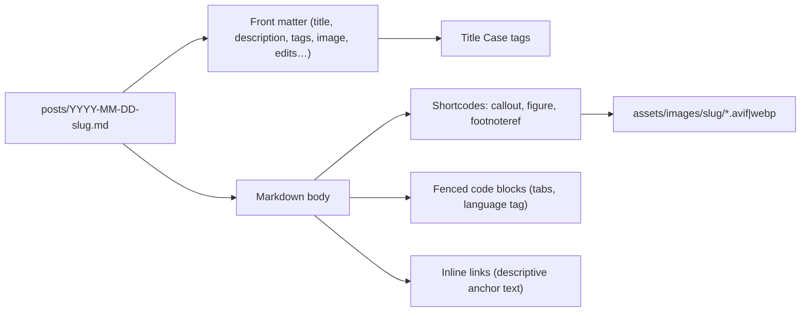

# Editorial Styleguide

This document captures the conventions, voice, and formatting patterns used across blog posts on this website. It is meant to serve as both a self-reference when drafting or editing a new article, and an instruction file an AI assistant can read and follow when helping with content.

When in doubt, prefer the patterns observed in recent (2025–2026) posts as they reflect the most current conventions. Older posts may not always comply, and should not be used as references unless they are explicitly cited here.

## Table of contents

1. [How content is laid out](#how-content-is-laid-out)
2. [Locale and language](#locale-and-language)
3. [Voice and tone](#voice-and-tone)
4. [Title capitalization and filenames](#title-capitalization-and-filenames)
5. [Front matter](#front-matter)
6. [Document structure](#document-structure)
7. [Links](#links)
8. [Images and figures](#images-and-figures)
9. [Callouts, blockquotes and asides](#callouts-blockquotes-and-asides)
10. [Footnotes](#footnotes)
11. [Code blocks](#code-blocks)
12. [CodePen embeds](#codepen-embeds)
13. [Lists](#lists)
14. [Inline formatting and typography](#inline-formatting-and-typography)
15. [Cross-references](#cross-references)
16. [Editorial checklist](#editorial-checklist)
17. [Things to avoid](#things-to-avoid)

## How content is laid out

A glanceable mental model of where each piece of content lives.



Posts live in [`posts/`](posts/) and are named `YYYY-MM-DD-kebab-case-slug.md`. The filename derives the URL (`/:year/:month/:day/:slug/`) and the publication date.

## Locale and language

- American English spelling: `color`, `organize`, `behavior`, `optimization`, `favorite` (not `colour`, `organise`, `behaviour`).
- Curly quotes everywhere in prose: `’` for apostrophes (not `'`), `“ ”` for double quotes (not `" "`). Quotes are not automatically normalized. Write them right.
- Em dashes (`—`) for parenthetical asides, en dashes (`–`) for numeric ranges (`1–2 minutes`, `5–10 seconds`). Hyphens (`-`) only for compound words (`take-home`, `culture-add`).
- Foreign phrases are wrapped in `<span lang="…">` and italicized:

  ```md
  *<span lang="la">Alea iacta est</span>*.
  I have been very *<span lang="fr">laissez-faire</span>* with image optimization.
  ```

- Acronyms are wrapped in `<abbr title="…">` on their first occurrence in the article:

  ```md
  The major <abbr title="Too Long; Didn’t Read">TL;DR</abbr> is that…
  I am currently building a companion website for the solo <abbr title="Table-Top Role-Playing Game">TTRPG</abbr> …
  ```

## Voice and tone

The voice is first-person, conversational, opinionated but kind, and lightly self-deprecating. Articles read like talking to a friend who happens to know a lot about the topic.

A few signature mannerisms:

- Smiley faces in prose: `:)`, occasionally `(:` for variety. Used sparingly to soften a sentence or close a section warmly.
- The occasional onomatopoeic punctuation: `Yay!`, `Boom!`, `Touché.`
- Strikethrough for jokey self-corrections:

  ```md
  Then I modified the `is_server_running` function to execute that Rust ~~script~~ binary.
  ~~For some reason, I am still running ads on this website~~.
  ```

- Comfortable acknowledging uncertainty and asking readers for help: `“If someone knows how to do better, let me know”`, `“I’m not sure why this works, but…”`, `“Fair warning: I actually don’t know if this is appropriate”`.
- Plain, direct sentences. Avoid corporate buzzwords (`synergize`, `unlock value`, `paradigm shift`) unless used ironically.
- It is okay to be opinionated, even strongly so, as long as opinions are reasoned and respectful. The post on AI ([`posts/2026-04-29-you-cannot-spell-pain-without-ai.md`](posts/2026-04-29-you-cannot-spell-pain-without-ai.md)) is a good example.

What to avoid: see [Things to avoid](#things-to-avoid).

## Title capitalization and filenames

Titles use [APA title case](https://apastyle.apa.org/style-grammar-guidelines/capitalization/title-case): capitalize the first and last word, all major words, and any word of four or more letters. Lowercase short prepositions, articles and conjunctions (`a`, `an`, `the`, `of`, `in`, `on`, `to`, `for`, `with`, `as`, `at`, `by`, `and`, `but`, `or`, `nor`).

Good examples from the archive:

- *Heading Anchors With Eleventy*
- *Folded Corner With CSS*
- *Six Months of Rust*
- *An Interactive Cover Component*
- *Play Sound When Claude Idles (on macOS)*
- *Optimizing Images with Eleventy on Netlify*

Use `&` instead of `and` only when it noticeably improves the typography (Baskerville renders `&` beautifully):

- *On Chardet, AI & OSS Licensing*

Filenames are `YYYY-MM-DD-kebab-case-slug.md` in [`posts/`](posts/). The slug should be short, descriptive and stable — once published, do not rename it (use redirects in [`public/_redirects`](public/_redirects) if you absolutely must). Numeric-prefixed shortcuts like `11ty` are fine in slugs even though we now write *Eleventy* in titles and prose.

## Front matter

Every post starts with YAML front matter. This is the canonical reference.

```yaml
---
title: Optimizing Images with Eleventy on Netlify
description: A short glance at the few steps I’ve taken to optimize images on this website, without compromising on build time.
tags:
  - Eleventy
  - Performance
  - Netlify
image: /assets/images/optimizing-images/banner.avif
---
```

### Required fields

- `title`: The article title in [APA title case](#title-capitalization-and-filenames). No trailing period.
- `description`: A single-sentence summary used for SEO, the OG card and RSS summaries.
- `tags`: An array of Title Case tags. Reuse existing tags whenever possible.

### Optional fields

- `image`: Path to the Open Graph and post-header image, e.g. `/assets/images/<slug>/banner.avif`.
- `edits`: An array of `{ date, md }` objects, one per substantive update after publication. The `md` value supports inline Markdown.

  ```yaml
  edits:
    - date: 2026/04/29
      md: A mere *hours* after I published this post, an AI news website scrapped my content and republished some AI-generated summary with zero added value. You can’t make this up.
  ```

- `guest`: Author name for guest posts.
- `external`: An object for externally hosted posts, with `host` and `url` keys. These entries are listed in indexes but not rendered locally.

```yaml
external:
  host: Tuts+
  url: https://webdesign.tutsplus.com/articles/getting-to-know-libsass--cms-23114
```
- `deprecated`: Boolean. Marks the post as outdated and renders a deprecation notice via [`includes/post_deprecated.liquid`](includes/post_deprecated.liquid).
- `toc`: Boolean (defaults to `true`). Set to `false` for very short posts where a TOC adds no value.

### Drafts

To keep a post as a draft, set `draft: true` in front matter.

## Document structure

A typical post follows this shape:

1. Opening hook (1–3 short paragraphs). Set the context, then state what this post is about. Do not restate the title verbatim; assume the reader has seen it.
2. Body, organized with `##` top-level sections and `###` subsections. Do not skip levels (no `####` directly under `##`).
3. Closing section with a small reflection — not a recap. Use any of these recurring patterns:
   - `## Wrapping up`
   - `## Closing thoughts`
   - `## Lessons learned`
   - `## What’s next?`

Heading-level rules:

- `#` is reserved for the post title (rendered from `title` front matter); do not use `#` in the body.
- `##` for top-level sections.
- `###` for subsections within a `##`.
- `####` is rare; if you find yourself reaching for it, reconsider the structure.

The opening sentence should never feel like a forced summary. Compare:

```md
<!-- Avoid -->
In this article, we will explore how to set up feature toggles in Eleventy.

<!-- Prefer -->
As my website grew, I noticed I started using more and more environment conditionals, like checking whether the site is built for development or production. It’s not a code smell per se, and there are certainly many reasons to do so:
```

## Links

- Use inline Markdown links with descriptive anchor text. Never `[click here]` and never bare URLs in prose.
- Link generously to [MDN](https://developer.mozilla.org/), [caniuse](https://caniuse.com/), the original author of an idea, and to own related posts.
- Cross-references to own posts use the URL path, not the file path: `/2026/04/27/spring-cleaning/`, not `posts/2026-04-27-spring-cleaning.md`.
- When linking to the title of an article (yours or someone else’s), italicize the link:

  ```md
  Recently, Dave Rupert posted *[I don’t want a screenshot of your Claude conversation](https://daverupert.com/2026/04/claude-no/)*, which really resonated with me.
  ```

- Repository links: prefer GitHub permalinks like `https://github.com/KittyGiraudel/site/blob/main/…` so they don’t rot when the file moves.
- External links inside footnote `assign` strings use single quotes for HTML attributes:

  ```md
  
  ```

## Images and figures

In-content imagery uses the [`figure.liquid`](includes/figure.liquid) shortcode, never bare Markdown ``:

```liquid

```

Conventions:

- Asset path: `/assets/images/<post-slug>/…`. Create a subdirectory matching the post slug.
- Format: prefer AVIF or WebP. The Eleventy image transform plugin (configured in [`eleventy.config.ts`](eleventy.config.ts)) automatically generates responsive `widths` and `sizes`, so do not author `<picture>` markup manually.
- `alt` is required. It must describe the image, not duplicate the caption verbatim. The caption is shown to everyone; the alt text is for users who cannot see the image and should be self-sufficient.
- `caption` allows inline HTML (so you can include links, emphasis, etc.).
- Front-matter `image` is the OG/social card image. Reference it via the same `/assets/images/<slug>/…` path.

### Generated article images

When generating images for recent technical articles, keep them visually cohesive so the home-page cards feel like a set. Use this shared direction as the baseline, then adapt the central metaphor to the article:

```txt
A refined editorial tech illustration for a blog post titled “[ARTICLE TITLE]”.
Landscape composition, 1.91:1 (1200x630) ratio, designed as a blog card/cover
image. Use a minimalist personal blog aesthetic: soft off-white paper background,
subtle grain texture, gentle shadows, elegant clean spacing.
Palette centered on warm pink (#dd7eb4) and medium blue (#267cb9),
with muted charcoal and pale gray accents.

Style: modern flat vector, thin line art, soft translucent gradients,
dotted connector lines, delicate code-inspired glyphs, calm and polished.
No photorealism, no 3D render, no stock image feel.
Avoid official logos; small text chips such as “11ty”, “data.json”,
“<a>”, “aria-live”, or “cache” are fine when they support the concept.

Typography in image: avoid large readable text. Keep any labels tiny,
clean, and secondary. Ensure strong readability at thumbnail sizes,
with a clear silhouette and enough negative space for card layouts.
```

Article-specific prompts should describe the article’s data flow or conceptual tension in one clean diagram-like scene:

- For routing/semantic HTML posts, show the mismatch and resolution (`button` → `<a>`, reload → client-side navigation).
- For build pipeline posts, show source input → transformation steps → cached or optimized output.
- For accessibility posts, include restrained semantic hints (`label`, `aria-live`, `status`) without turning the image into documentation.
- For DOM/runtime posts, show the browser or DOM node, the state being lost, and the small mechanism that restores or preserves it.

Prefer one central idea over a collage of every section in the article. The image should be understandable in a small card before it is clever at full size.

## Callouts, blockquotes and asides

There are two distinct constructs that look superficially similar but mean different things.

### Blockquotes

Reserved for actual quotations from a person, document, or article. Always attribute on a new line with an em-dash:

```md
> Your AI usage is now a KPI. You are being evaluated on how much grain you reported, not how much grain you grew.  
> — Han Lee, in [The AI Great Lead Forward](https://leehanchung.github.io/blogs/2026/04/05/the-ai-great-leap-forward/)
```

Do not use blockquotes for editorial asides or side-notes. The site styles them as quotations (with curly quotation marks and a different gradient) and using them for callouts is semantically wrong.

### Callouts

Use the paired `callout` Liquid shortcode for editorial asides — clarifications, caveats, side-notes, fun facts:

```liquid

Side note: Cargo uses [TOML](https://toml.io/en/) as a configuration format and it’s just so much better than JSON.

```

A `warning` variant exists for stronger emphasis (use sparingly):

```liquid

Before we dive into the code, I think it’s worth pointing out that the goal is largely to be immersive…

```

The shortcode supports inline Markdown inside the body. Put the opening tag on its own line if the content spans multiple paragraphs.

## Footnotes

Footnotes use [eleventy-plugin-footnotes](https://kittygiraudel.github.io/accessible-footnotes/eleventy/overview) and follow a two-step Liquid approach in this site: first define the footnote text in a variable, then reference that variable inline where the marker should appear.

### Pattern

```liquid

```

Then, anywhere within the same template scope:

```liquid
… as long as you have the anchor text in prose.
```

### Conventions

- IDs are kebab-case and must be unique within the post: `consecutive-failures`, `cargo-run`, `systemd-killmode`, `genuineness`.
- Variable names mirror the ID, use underscores, and start with `footnote_`: `footnote_consecutive_failures`, `footnote_cargo_run`, `footnote_systemd_killmode`.
- HTML is allowed inside the assign string. Use single quotes for HTML attributes since the assign value is itself a double-quoted string:

  ```liquid
  
  ```

- Place the `assign` near the section where the footnote is referenced. For long posts, keeping declarations close to their use makes the source easier to follow.
- Anchor text should be the natural words you want to make footnote-bearing, typically a short noun phrase, not a whole sentence.

## Code blocks

### Language tag

Always specify a language tag on fenced code blocks:

```js
const PRODUCTION = process.env.NODE_ENV === 'production'
```

Common tags: `js`, `ts`, `rust`, `bash`, `sh`, `css`, `html`, `liquid`, `json`, `md`, `yaml`, `toml`.

### Indentation

Use **tabs** for indentation in code blocks, not spaces. The site uses container-query-driven `tab-size` to scale indentation responsively, which only works with actual tab characters.

If you use Cursor or VS Code, set `editor.insertSpaces` to `false` for `.md` files, or use the find-and-replace conversion script approach mentioned in [Spring Cleaning](/2026/04/27/spring-cleaning/#tabbed-code-blocks).

### Highlighting lines

The syntax highlighter supports highlighting specific lines via `language/lineNumbers` after the opening fence:

````md
```css/4,8,12
.Cover__content {
	position: absolute;
	left: 0;
	right: 0;
	top: 100%;
}
```
````

Numbers refer to lines within the block. See [`posts/2026-04-09-an-interactive-cover-component.md`](posts/2026-04-09-an-interactive-cover-component.md) for live examples and verify by previewing locally.

### Long code blocks

When a code block is so long it dominates the article, wrap it in a `<details>` element so readers can expand on demand:

`````md
<details>
<summary>Read the full service definition (with explanation comments).</summary>

```sh
[Unit]
Description=Game Server Watchdog
…
```

</details>
`````

Keep the summary line descriptive enough to convey what is hidden.

### Liquid in code blocks

Showing Liquid syntax inside a code block is tricky because Eleventy will evaluate the tags. Two techniques are in use:

1. Wrap in `…` around the fenced block. Everything inside `` is passed through verbatim, so the inner Liquid tags render as text.
2. Insert a zero-width space (`U+200B`) between `{` and `%` (or between `{` and `{`) to break the parser without showing in the output. This is useful when `` itself would conflict (e.g. demonstrating `` syntax).

Look at [`posts/2026-04-30-feature-toggles-with-11ty.md`](posts/2026-04-30-feature-toggles-with-11ty.md) and [`posts/2026-02-26-nerdy-design-details.md`](posts/2026-02-26-nerdy-design-details.md) for live examples of both techniques.

### Misc

- Keep blocks **focused**. Trim unrelated code with `// …` (or `// … rest of the configuration`). Prefer multiple short blocks separated by prose over one giant dump.
- **Comment generously** in code blocks when the snippet is meant to teach. Code that ships in production is usually self-explanatory; code that lives in a blog post often needs orientation.

## CodePen embeds

Use the [`codepen.liquid`](includes/codepen.liquid) shortcode for interactive embeds.

Required argument:

- `slug`: The CodePen slug hash.

Optional arguments:

- `title`: Link title shown in the fallback sentence (defaults to `slug`).
- `user`: CodePen username (defaults to `KittyGiraudel`).
- `default_tab`: Initially opened tab (defaults to `result`).
- `height`: Embed height in pixels (defaults to `380`).

Canonical usage:

```liquid

```

Guidelines:

- Embed only when interaction materially helps understanding.
- Add one sentence of context before the embed, and one sentence after if readers need interpretation.
- Keep `height` practical; avoid very tall embeds unless necessary for readability.
- For purely static visuals, prefer `figure.liquid` instead of an embedded pen.

## Lists

- Bullet lists for parallel items where order does not matter.
- Ordered lists for sequences, steps and numbered references.
- Each item should express a complete-ish thought. End full-sentence items with a period; leave fragments un-punctuated. Pick one style per list and stay consistent.
- It is fine for items to span multiple sentences, but if many items do, consider breaking them into prose paragraphs instead.
- Use them deliberately, not as a fallback for "I couldn’t structure this paragraph".

## Inline formatting and typography

- `` `code` `` for identifiers, file names, paths, CLI commands, flags, HTTP headers, environment variables, configuration keys.
- `_italics_` (or `*italics*`) for emphasis and titles of works.
- `**bold**` very sparingly. Reserve it for rare, critical scan points (for example, one short warning in a long section). Most bold instincts can be replaced by italics, a callout, or restructuring the sentence.
- Em dashes (`—`) are great for asides and parenthetical thoughts, but be aware they have become an LLM tell. When the sentence reads naturally with commas or parentheses, prefer those.
- Numbers: write small numbers in words for prose (`one`, `two`, `three`), but use digits with units (`5 minutes`, `8 vCPUs`, `30 seconds`, `200 players`) and in any technical or quantitative context. Use thousands separators with commas: `1,000 players`, `16,180 tokens`.
- Currency uses the symbol prefix and digits: `$5,000`, `$15B`.
- Emojis are auto-wrapped at build time in `<span role="img" aria-label>` for accessibility; you do not need to wrap them manually. Use them sparingly anyway (see [Things to avoid](#things-to-avoid)).

## Cross-references

- Internal links to other posts use the URL path: `/2026/04/27/spring-cleaning/`. Never use the file path or a `posts/…` relative link in body content.
- Self-reference is encouraged. When you have written about a topic before, link to it: `“more on this in [my previous article](/2026/03/11/serving-markdown-to-llms-with-11ty/)”`.
- Same-page anchors use `#kebab-case-heading-id`. Eleventy slugifies headings via `@sindresorhus/slugify`. To verify an anchor exists, build the site (`npm run build`) and inspect the rendered HTML, or run `npm start` and navigate to the page.
- When you link to a sub-section of another post, include the anchor: `[heading anchors](/2026/02/26/nerdy-design-details/#heading-anchors)`.

## Editorial checklist

Before publishing (or before merging a draft), run through this list:

- [ ] Title is in [APA title case](#title-capitalization-and-filenames) and not duplicated in the opening paragraph.
- [ ] Description is a single sentence and reads well as the OG/SEO summary.
- [ ] Tags are Title Case and reuse existing tags wherever possible.
- [ ] Filename is `YYYY-MM-DD-kebab-case-slug.md`.
- [ ] Opening hooks the reader without rehashing the title.
- [ ] Headings start at `##`, do not skip levels, and the post ends on a small reflection (Wrapping up / Lessons learned / etc.).
- [ ] All images go through the `figure.liquid` shortcode, live under `/assets/images/<slug>/`, and have meaningful `alt` text distinct from the caption.
- [ ] All callouts use `…`; blockquotes (`>`) are only used for actual quotations with attribution.
- [ ] All footnotes declare an `assign` and resolve via `footnoteref`; IDs are unique within the post.
- [ ] Code blocks carry a language tag, are indented with tabs, and Liquid examples are escaped via `` or zero-width spaces.
- [ ] CodePen embeds (if any) use `codepen.liquid` with at least `slug`, and include useful surrounding context.
- [ ] Links have descriptive anchor text; cross-references to your own posts use the URL path, not the file path.
- [ ] Acronyms are wrapped in `<abbr title="…">` on first occurrence.
- [ ] Foreign phrases use `<span lang="…">` and are italicized.
- [ ] Curly quotes (`’`, `“ ”`) are used throughout prose. No straight quotes outside of code.
- [ ] No naked URLs in prose; no `click here` link text.
- [ ] Spell-check with American English. Read the post out loud once if it’s long.

## Things to avoid

- Generic AI/copywriter phrasing: `Let’s dive in!`, `In today’s fast-paced world…`, `It’s no secret that…`, `Buckle up!`, `Welcome to the future of…` (see [Wikipedia’s Signs of AI writing](https://en.wikipedia.org/wiki/Wikipedia:Signs_of_AI_writing)). If a sentence could open any blog post on any topic, rewrite it.
- Over-using em dashes. They are now an LLM tell. Use them deliberately, not reflexively.
- Over-using exclamation points and emoji. The site’s voice is warm; it does not need to shout. One or two `:)` per long post is plenty.
- Naked URLs in prose: `https://example.com` floating in a sentence. Always wrap in a Markdown link with descriptive text.
- Vague link text: `[here]`, `[this article]`, `[link]`. Describe the destination.
- Restating the title in the opening paragraph. The reader just read the title.
- Blockquotes for asides. Use `` instead.
- Bare Markdown images (``). Use `figure.liquid`.
- Spaces for code indentation. Use tabs.
- British spelling, mixed with American: pick American and stick to it.
- Long, undivided walls of text. Break up dense sections with subheadings, lists, or callouts.
- Comments that narrate code. In code blocks meant to teach, comment on intent (`// Avoid thrashing by capping restarts within a window`), not mechanics (`// Increment the counter`).
- Closed-off endings. Invite the reader to share corrections, alternative approaches, or experiences. The community is part of the value.
